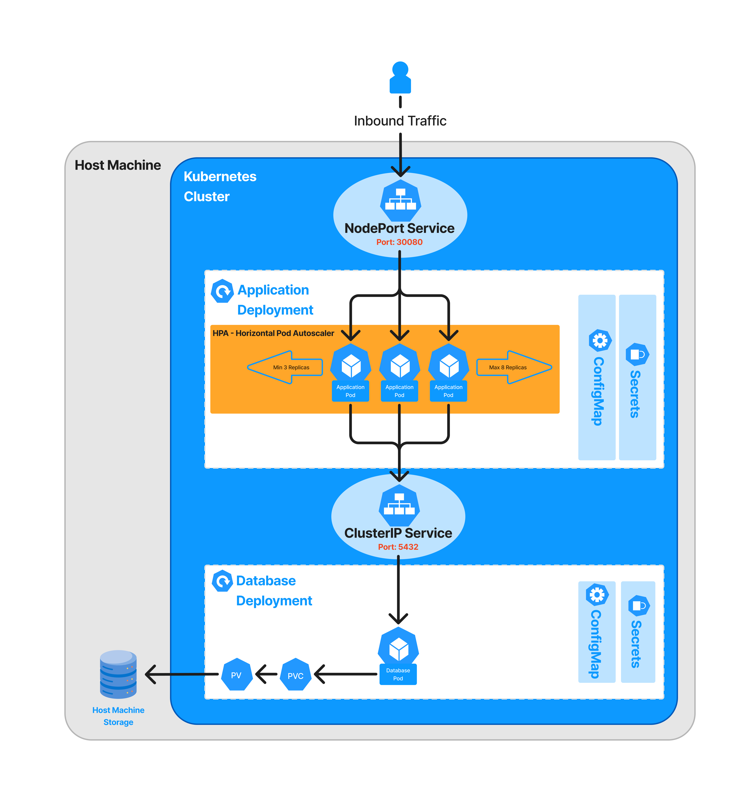

# Kubernetes Architecture Diagram



# How to execute this project

### Requirements
1. WSL on Windows
2. Docker
3. Docker Desktop
4. Kubernetes
5. Helm

### 1. Build the Docker Image

```sh
docker build -t tech-challenge-fase-1 .
```

### 2. Apply all Application K8s Manifests

```sh
helm install fiap-tech-challenge ./infra
```

### 3. Test the application

```sh
curl -X GET "localhost:30080/customers"
```

### Useful commands

```sh
kubectl rollout restart deployment poc-hexagonal-arch
```

```sh
watch -n 1 kubectl top pods
```

```sh
kubectl delete all --all -n default
```

```sh
kubectl port-forward service/poc-hexagonal-arch 30080:8080
```

Enjoy! API should be accessible on localhost:30080

### Running Docker containers

1. Access the folder where docker-compose.yml is located
2. Run the command:

```
docker compose up -d 
```

### Accessing OpenAPI/Swagger

1. Open the url on your web browser: ```http://localhost:8080/swagger-ui/index.html```

### Connecting to Postgres using PGAdmin

1. Access PGAdmin on any web browser using the address: http://localhost:5050/
2. If this is the first time, set a master password, such as: master
3. Create a server with the following configuration:

```
Name: Any Name
Host name/address: host.docker.internal
Port: 5432
Username: postgres
Password: changeme
```

### Install Kubernetes Metrics Server

Metrics server is needed in order to Horizontal Pod (HPA) Autoscaling to work properly

```sh
kubectl apply -f https://github.com/kubernetes-sigs/metrics-server/releases/latest/download/components.yaml
```