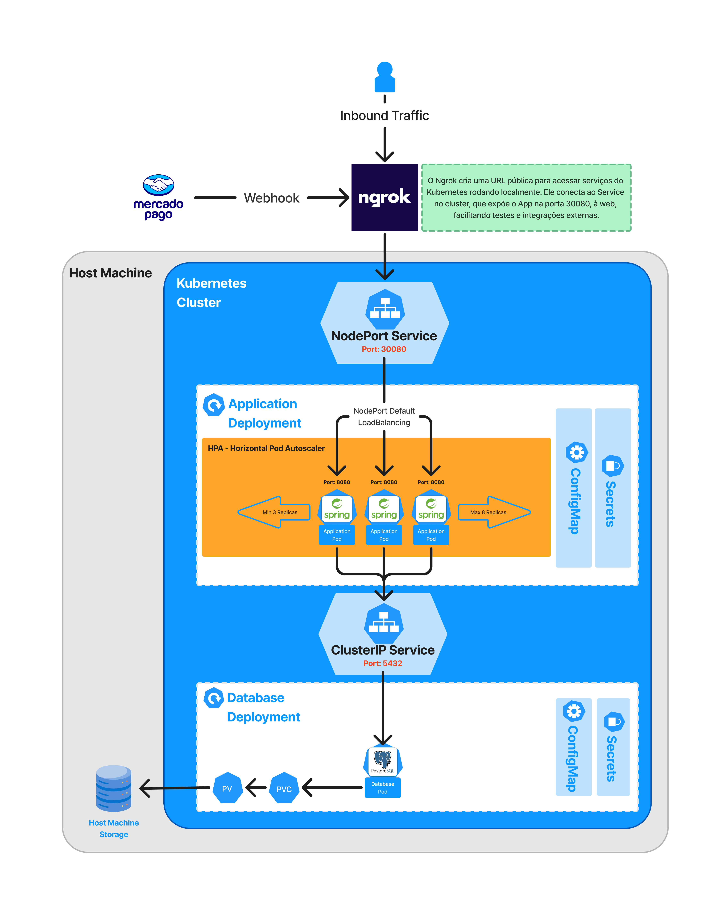

# O Problema

A lanchonete está enfrentando um alto número de requisições devido ao aumento da demanda. 
Para lidar com essa carga e garantir alta disponibilidade e escalabilidade, 
foi implementado um cluster Kubernetes (K8s) preparado para fazer o autoscaling dos PODs com HPA.

---

# Diagrama da Arquitetura Kubernetes



---

# Como executar este projeto

### Requisitos
1. WSL no Windows
2. Docker
3. Docker Desktop
4. Kubernetes
5. Helm
6. Ngrok
6. (Opcional) Lens

---
### 1. (Opcional) Executar o NGROK
OBS: Esse passo somente é necessário caso deseje testar a integração com o Mercado Pago e Webhook

```sh
ngrok http 30080
```
Os exemplos a seguir evidenciam como criar uma Aplicação no Mercado Pago e integrar com sua aplicação:

https://github.com/mercadopago/pix-payment-sample-java/tree/main
https://github.com/dannevesdantas/poc-mercadopago

No arquivo infra/values.yaml substituir as ENVs ACCESS_TOKEN_MERCADO_PAGO e NOTIFICATION_URL_NGROK

### 2. Construir a Imagem Docker

```sh
docker build -t tech-challenge-fase-1 .
```

### 3. Aplicar todos os Manifests do Aplicativo no Kubernetes

```sh
helm install fiap-tech-challenge ./infra
```

### 4. Testar o aplicativo

```sh
curl -X GET "localhost:30080/customers"
```

### 5. Instalar o Kubernetes Metrics Server

O Metrics Server é necessário para que o Horizontal Pod Autoscaler (HPA) funcione corretamente.

```sh
kubectl apply -f https://github.com/kubernetes-sigs/metrics-server/releases/latest/download/components.yaml
```

---

### Executando contêineres Docker

1. Acesse a pasta onde o arquivo `docker-compose.yml` está localizado.
2. Execute o comando:

```sh
docker compose up -d
```

---

### Acessando a documentação OpenAPI/Swagger

1. Abra o URL no seu navegador:

```sh
http://localhost:30080/swagger-ui/index.html
```
